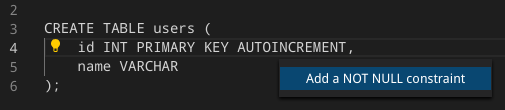
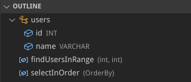



    

        Learn everything about Dart-SQL interop, the SQL IDE, experimental ffi support and everything new in moor
    



{}
## Generator overhaul

The rewritten compiler is faster than ever, supports more SQL features and gives you
more flexibility when writing database code.

[Check the updated documentation]()
{}


{}
The new type inference engine provides more accurate results on complex expressions like window
functions. We also generate simpler methods for queries that only return one column.
{}
{}
We now support more advanced features like compound select statements and window functions,
including detailed static analysis and lints.
{}
{}
Declare tables in Dart, write your queries in SQL. Or do it the other way around. Or do it all in Dart.
Or all in SQL. Moor makes writing database code fun without taking control over your code. 
For maximum flexibilty, moor lets you inline Dart expressions into SQL and use the best of both
worlds.
{}



{}
## Builtin SQL IDE

Moor 2.0 expands the previous sql parser and analyzer, providing real-time feedback on your
SQL queries as you type. Moor plugs right into the Dart analysis server, so you don't have
to install any additional extensions.

[Learn more about the IDE]()
{}


{}

Moor lets you write query code faster with helpful actions.
{}
{}

Moor analyzes statements as you write them and reports errors right away. 
This helps you identify problems fast, without having to open your app.
{}
{}

Moor provides an outline of your tables and queries for a better overview.
{}



{}
## And much, much more

Moor 2.0 contains a set of optimizations and makes common tasks simpler
{}


{}
New utils to load database from assets or to perform additional work before creating a database.
{}
{}
We removed a whole bunch of deprecated apis that made it harder to develop new features.

[Read the changelog for details](https://pub.dev/packages/moor#-changelog-tab-)
{}
{}
The new [moor_ffi](https://pub.dev/packages/moor_ffi) package brings moor to the desktop and is up to 500x faster than the old
implementation.

_Please not that the package is still in preview_
{}




## Try moor now

- To get started with moor, follow our [getting started guide](ref "../docs/Getting started/_index.md") here.
- To get started with SQL in moor, or to migrate an project to moor, follow our __TODO: Write migration guide__

